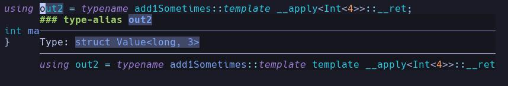

# PPLang

This language enables you to conveniently do type masturbation on a large scale! No one can read C++ template code, now you don't have to write it! Use PPLang to generate mazes of instant-legacy code (tm)!

## Why the name?

PPLang is named as such for one reason, and one reason ***only***: it is cpp without the c.

## Why use PPLang

PPLang, being a pure functional language, has no side effects. Not even haskell can claim that! Thus, PPLang is obviously perfect in every way

The only possible downside is an accidental loss of will to live due to viewing the compiled output (the death rate on that is about equal to standing at the top of chernobyl reactor building 4 on april 27, 1986)

## What does it do?

Simply put, C++ templates are a turing complete pure functional language. PPLang is a pure functional possibly turing complete language that compiles to C++ templates.

## Compiling and running your code

To compile your code simply run `zig build run` in this directory. This will automatically build `lang._pp` into `urmom.cpp`. If you want to build other files use `zig build run -- -i <inputfile> -o <outputfile>`

If you want to inspect the output of your code, simply open up the compiled cpp file, navigate to the `using <variableyouwanttosee> = ...` line, then hover over it (with clangd attached already) to see its value:



(this demo was made using example code below)

## How does it work/Language Overview

Everything is a class. that `3` that you wrote into your program? it's a class. Functions are class templates, with a wrapper class so that they can be passed around like values.

PP code is very simple. You can create variables:

```
let x = 4;
```

and you can add types to them:

```
let x: int = 4;
```

(technical note: pp does not actually have a type checker, types are just there to make you feel better)

The compiled C++ is very trivial to understand:

```cpp
using x = Int<4>;
```

Now let's write some functions:

```
fn add1(x: int) -> int {
    return x + 1;
}
```

Note that the return and parameter types are ***required***. 

PPLang does not have ifs or whiles or fors (such operations are for plebians, and are not allowed in the pure function world of pp). Instead, you must use a `where` statement to conditionally control when functions are ran:

```
fn add1Sometimes(x: int) -> int {
    return x + 1;
}
fn add1Sometimes(x: int) where x == 4 {
    return x - 1;
}

// out1 is 2
let out1 = add1Sometimes(1);
// out2 is 3
let out2 = add1Sometimes(4);
```

Note that the first function overload MUST NOT have a `where` clause. All others MUST have a `where` clause (even if it's `where true`). Requiring `where` clauses is a current limitation of the language because it doesnt have scope tracking

`where` clauses are internally implemented by C++ `requires` clauses

Now let's look at the simplified generated C++:

```cpp
template <typename x>
struct add1Sometimes__actual {
    using __ret = typename Add<x, Int<1>>::__ret;
};

struct add1Sometimes {
    template <typename x>
    using __apply = add1Sometimes__actual<x>;
};

template <typename x>
    requires(GetValue<typename Equals<x, Int<4>>::__ret>::val)
struct add1Sometimes__actual<x> {
    using __ret = typename Sub<x, Int<1>>::__ret;
};

using out1 = typename add1Sometimes::template __apply<Int<1>>::__ret;

using out2 = typename add1Sometimes::template __apply<Int<4>>::__ret;
```

ohhhh... let's.... never do that again

pplang also has arrays:

```
let array = [1, 2, 3];
```

and parameter packs (which must only have one and be the last one):

```
fn params(yo...: int) -> int {
    return 0;
}
```

If you want to create a function that accepts any number of args, you have to use parameter packs, then overload it:

```
fn sumAll(values...: int) -> int {
    return 0;
}
fn sumAll(v: int, rest...: int) where true {
    return v + sumAll(rest...);
}

// returns 6
let out = sumAll(1, 2, 3);
```

Fortunately, you can pattern match on arrays, but that can only be done in overloads of a function, not the original function!:

```
fn thing(v: any) -> any {}

fn thing([v1: int, v2: int, rest...]) where true {
    return v1 + v2;
}

// returns 3
let output = thing([1, 2, 3, 4]);
```

```
fn mergeArrays(left: any, right: any) -> any {
    return [];
}
fn mergeArrays([left...: any]: any, [right...: any]: any) where true {
    return [left..., right...];
}
```

You can create and index arrays:

```
let array = [1, 2, 3];
// returns 2
let out = array[1];
```

Closures are allowed and work properly:

```
fn getClosure(v: int) -> fn(int) -> int {
    fn ret(add: int) -> int {
        return v + add;
    }
    return ret;
}

let f = getClosure(3);

// returns 7
let out = f(4);
```

Functions are first-class and can be pased as parameters

### Io

PP is so pure that io is basically impossible (PP is even MORE pure than haskell)!

The only io allowed is the print function. For it to work, it must be assigned to a variable and can only be used at the top level:

```
let x = print(3);
```

```
// prints 5 and a newline
let x = print(5, '\n');
```

To run this code, simply:

```
zig build run

clang <cpp file> -lstdc++ -std=c++23 && ./a.out
```

PP has no string type, so things are a lil gross rn

### Lang reference

Idk, read `lang._pp`. I think that has everything that's allowed in the language

### Stdlib

PPLang ships with a comprehensive, best-in-class standard library and automatically imported prelude (`prelude._pp`)

### Problems

PP has no operator precedence and only uses right associative operators right now (sorry). I'm not even sure if you can parenthesize expressions right now

The lexer has no diagnostics, so invalid tokens will just get the compiler to print:

There are so few operators implemented because I am lazy

```
Got 0 errors
```

Then exit without generating output

The parser has an attempt at diagnostics, but they are not good (read: almost useless)

The codebase is currently a mess because i wrote most of it over a few nights after having WAYY too much diet coke

### How to fix?

Do you want a feature? Submit an issue and I will prolly make it (bully driven development ftw)

Or, if you are crazy enough, submit a pr ig
